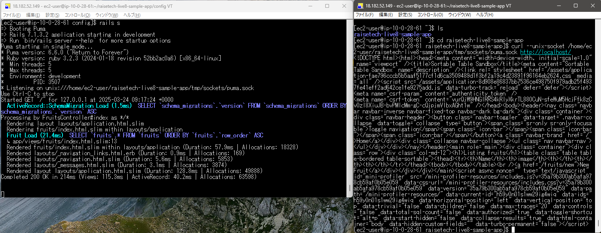
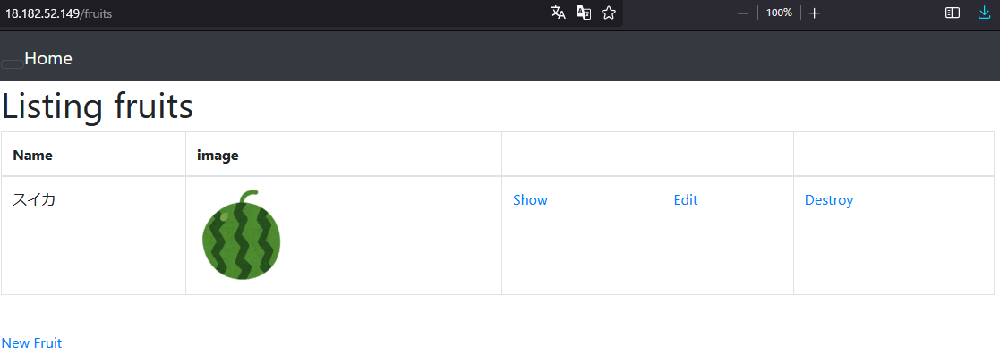
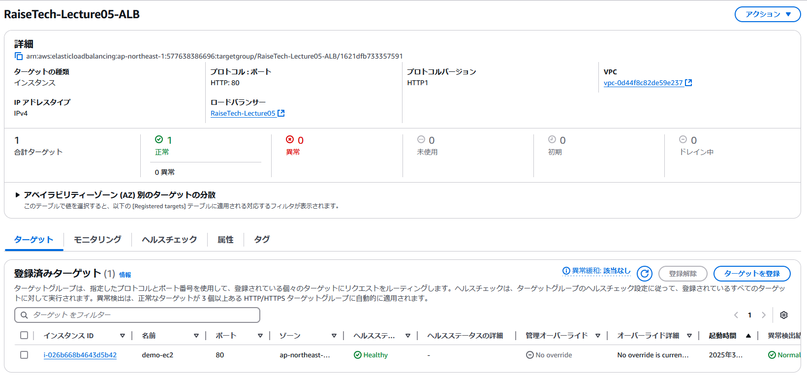
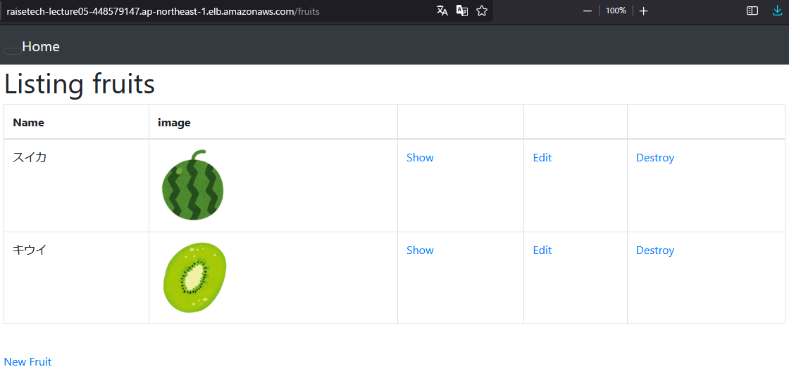
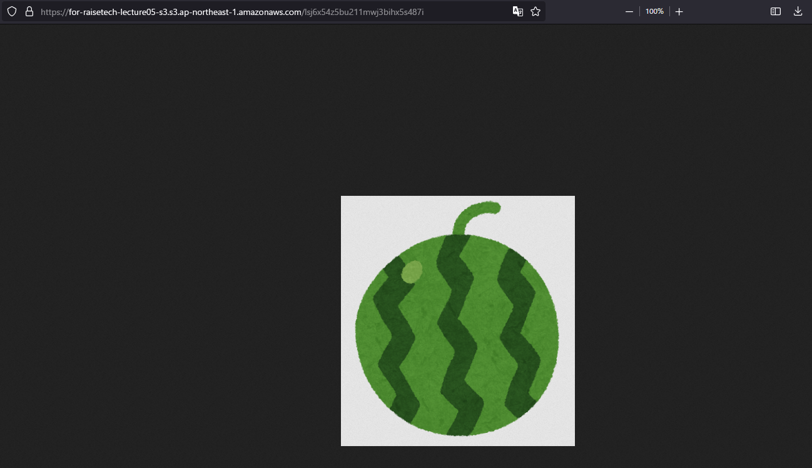
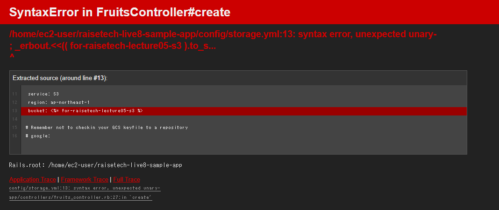
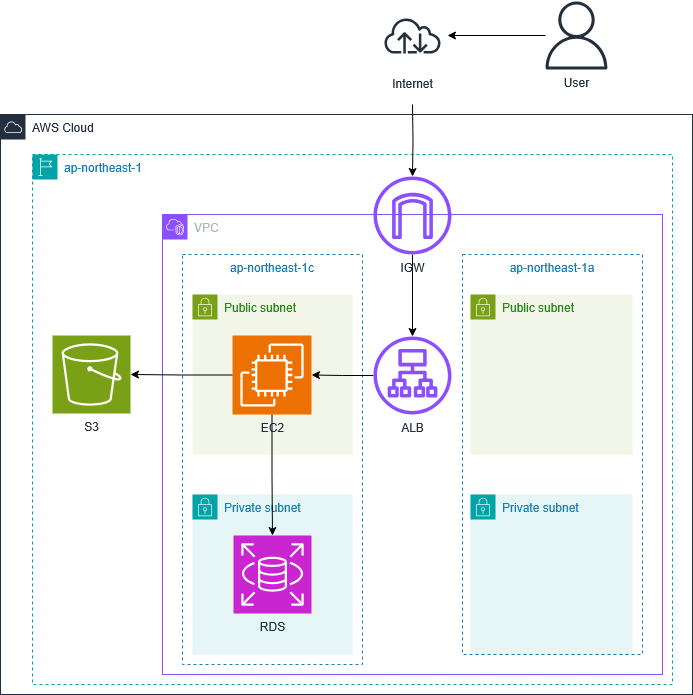

# 第 5 回課題

---

## 概要

**1. Puma のみで起動**

**2. 組み込みサーバーと Unix Socket を使って起動**

**3. Nginx のみで起動**

**4. Nginx / Puma / Unix Socket を組み合わせて起動**

**5. ALB を経由するように変更**

**6. ストレージを S3 へ変更**

**7. 構成図**

**8. 感想**

---

## 1.組み込みサーバーのみで起動

**問題が発生した際に原因を特定しやすいように、順番に動作確認をしていく**

1. 第三回講義で行った内容を参考にして環境構築。
2. `bin/dev`で起動し、パブリック IP とポート 3000 番を使ってアクセス。

   

## 2.Puma と Unix Socket を使って起動

1. PORT3000 番は使わないため、コメントアウト。

   ```
   puma.rb
   # port ENV.fetch("PORT") { 3000 }
   ```

2. 以下のコマンドでログを確認すると、HTML ファイルが表示される。
   `$ curl --unix-socket /home/ec2-user/raisetech-live8-sample-app/tmp/sockets/puma.sock http://localhost/`



## 3.まずは Nginx のみで起動

```
$ sudo amazon-linux-extras install nginx1  # Nginxインストール

$ sudo systemctl start nginx #Nginxを起動
```


## 4. WEB サーバー（Nginx）、AP サーバー（Puma）を組み合わせて起動

1. `/etc/nginx/nginx.conf`を編集
2. `$ sudo systemctl restart nginx # Nginxを再起動`
3. リポジトリの README を参考に、サンプルから`puma.service`を複製

```
$ sudo cp ~/raisetech-live8-sample-app/samples/puma.service.sample /etc/systemd/system/puma.service
$ sudo cat /etc/systemd/system/puma.service
```




> **Note: アプリケーションに CSS が適用されない**
>
> Nginx に権限を付与する必要がある模様。以下のコマンドで解決した。
>
> ```
> $ sudo chown -R ec2-user:ec2-user /var/lib/nginx
> $ sudo chmod -R 755 /var/lib/nginx
> ```
>
> **Note: 画像が表示されない**
> mini_magick を追加する。
> `config/application.rb  > config.active_storage.variant_processor = :mini_magick`

## 5.ALB を経由するように変更

1. ターゲットグループを作成する。
2. ALB を作成してターゲットグループをアタッチする。
3. ALB の DNS 名を使ってアクセス
   
   
   

> **ERROR: ALB からアクセスができない**
>
> `development.rb`を修正して、DNS 名によるアクセスを許可する
> `config.hosts > RaiseTech-Lecture05-448579147.ap-northeast-1.elb.amazonaws.com`
>
> 

## 6.ストレージに S3 を追加

1. パブリックアクセスブロックを無効化して、S3 バケットを作成する。
2. EC2 インスタンスに S3FullAccess 権限を付与した IAM ロールをアタッチする。
3. ストレージの保存先を変更する。
   `development.rb > config.active_storage.service = amazon`
4. S3 のバケット名を追加する。
   `config/storage.yml > bucket: "for-raisetech-lecture05-s3"`
   
   

> **ERROR: オブジェクトを直接開くことができない（AccessDenied）**
>
> `Storage.yml`と`source ~/.bash_profile`に IAM ユーザーのアクセスキーとシークレットアクセスキーの環境変数を設定すると解決した。

> **ERROR: SyntaxError**
>
> バケット名の前後にダブルコロンを付けて解決した。
>
> 

## 7.構成図



## 8.今回の課題で学んだ事

**Puma と Nginx を使ってアプリケーションをデプロイする**

- WEB サーバーと AP サーバーを切り分けてデプロイすることで負荷を分担させる。

**アプリケーションのデプロイを細かく切り分けながら行う**

- Puma や Nginx 等をまず単体で起動することで、不具合が発生した際に原因を特定しやすい環境を維持しながら開発することができた。

**ELB を利用する際のターゲットグループの役割**

- ALB での接続が上手くいかない時に、ターゲットグループが Unhealthy 状態になっていた。ターゲットグループはヘルスチェックの役割を担っているため、ターゲットに異常が発生しているかどうか確認できた。
