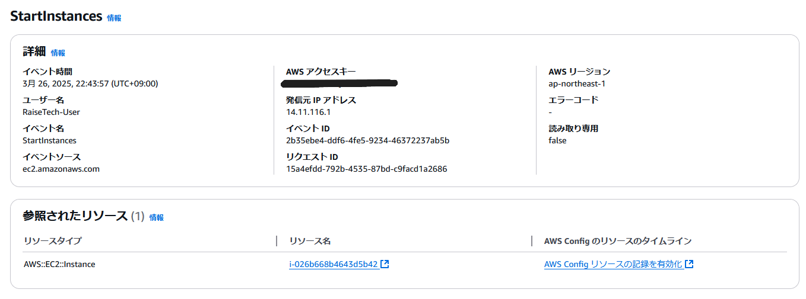
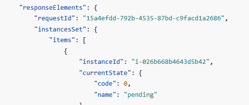
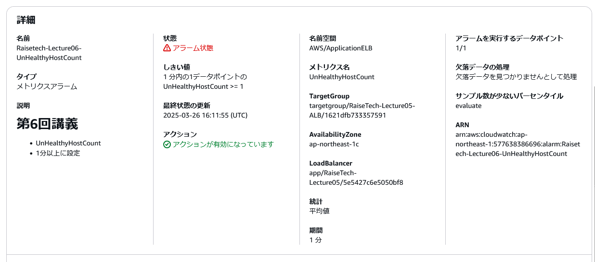
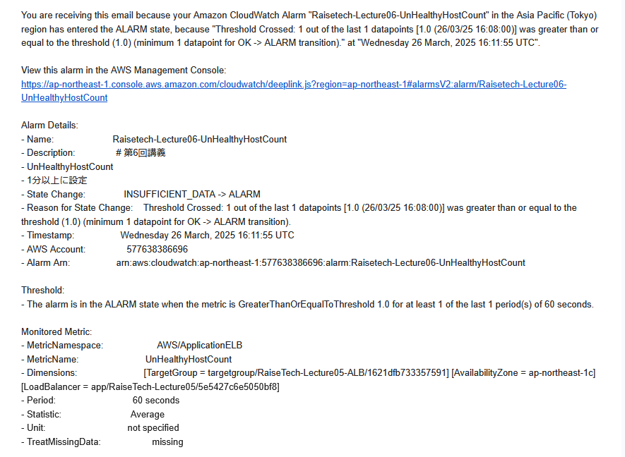
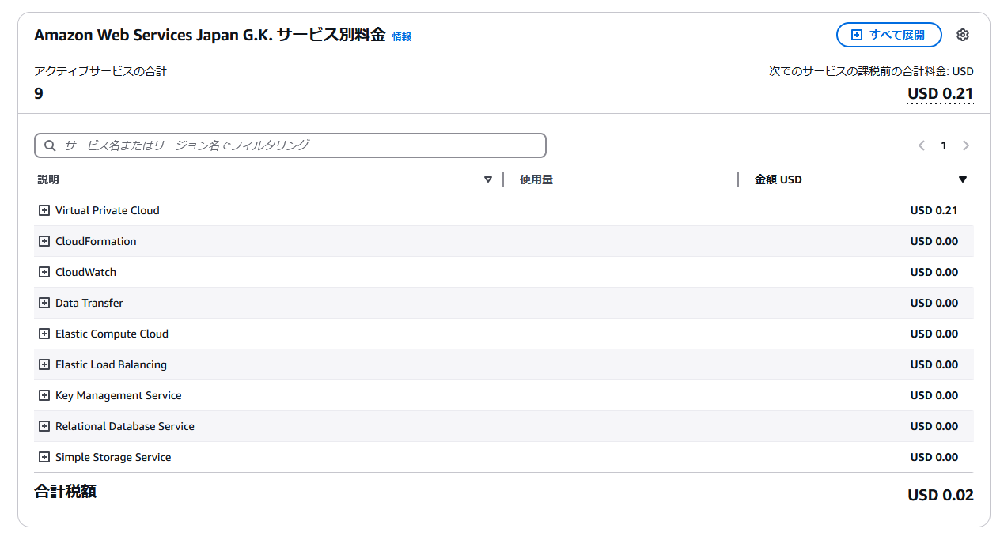

# 第 6 回課題の提出

## CloudTrail を使ったロギング

- AWS ユーザーの操作をロギングするサービス。
- Json 形式で詳細なログが保存される。

### 保存されるログの一例

**操作したユーザーに関する情報**

**イベントに関する情報**

**インスタンスのステータスがどうなったか**

## CloudWatch アラーム

- UnhealtyHostCount を記録する CloudWatch アラームを作成する。
- AmazonSNS と連携してメール通知する。
- アラーム状態と OK 状態を確認する。

**UnhealtyHostCount を メール で受け取る**

**OK アクションの設定と確認**

## AWS 利用料の見積り

[第 5 回までに作成したリソースを参考にした見積り](https://calculator.aws/#/estimate?id=5661dd7874eeff3bc0213b9e6f15dac359c68a3c)

## アカウントの利用料の確認

## 感想

- メトリクス・しきい値・アクションを設定することで CloudWatch のアラーム内容を詳細にコントロールできることを学びました。
- CloudTrail では、IAM グループを使った複数人の開発現場においてユーザーの操作情報を確認できるため実務での重要性を感じました。
