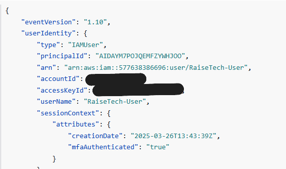
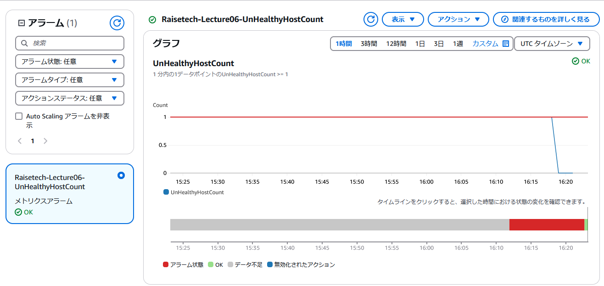

# 第 6 回課題の提出

## CloudTrail を使ったロギング

- ユーザーや IAM ロール、AWS で主体となるサービスによる操作をロギングするサービス。
- Json 形式で詳細なログが保存される。

### 保存されるログの一例

**操作したユーザーに関する情報**

- 操作したユーザー： `"RaiseTech-User"`

**イベントに関する情報**

- イベント名：`"StartInstances"`
- イベントが発生した時間やリージョン、ソース元の IP アドレスなど

**インスタンスのステータスがどうなったか**

- インスタンスの状態：`"Pending"`（起動準備中）

## CloudWatch アラーム

- UnhealtyHostCount を記録する CloudWatch アラームを作成する。
- AmazonSNS と連携してメール通知する。
- アラーム状態と OK 状態を確認する。

**UnhealtyHostCount を メール で受け取る**

**OK アクションの設定と確認**

## AWS 利用料の見積り

[第 5 回までに作成したリソースを参考にした見積り](https://calculator.aws/#/estimate?id=b8435e5195ba58dc9ad03129a833fabb6ad786bd)

## アカウントの利用料の確認

- ALB が内部で参照するパブリック IPv4 アドレスには無量利用枠が適用されないため、課金が発生している。
- AWS サービスを利用する際には、まず無料利用枠を確認するようにして、法外な請求が来ないように気を付ける。

## 感想

- メトリクス・しきい値・アクションを設定することで CloudWatch のアラーム内容を詳細にコントロールできることを学びました。
- CloudTrail では、IAM グループを使った複数人の開発現場においてユーザーの操作情報を確認できるため実務での重要性を感じました。
